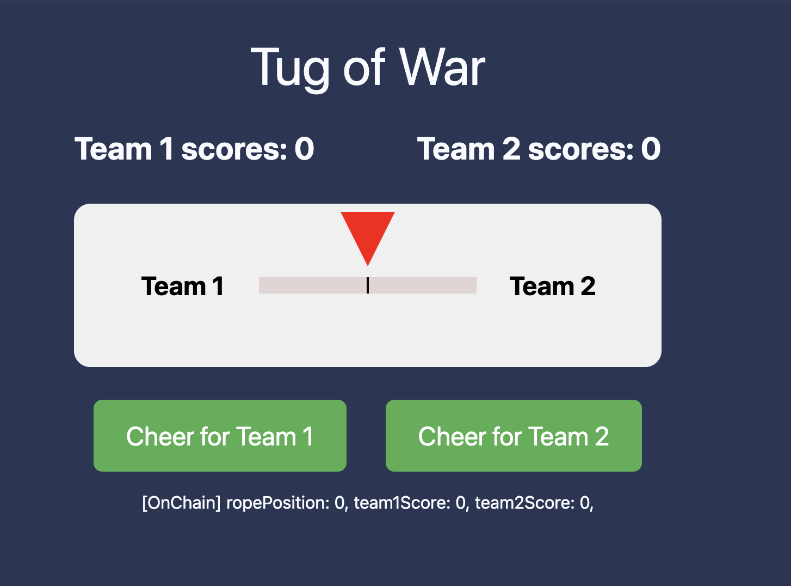

# Tug of War Game Demo on Monad Blockchain

<h4 align="center">
  <a href="https://docs.monad.xyz/">Documentation</a> |
  <a href="https://www.monad.xyz/">Website</a>
</h4>

Monad is a layer 1 blockchain with 10,000 transactions per second, 1-second block times, single-slot finality, and low-hardware requirements.

And this a demo is built on Monad.



## Requirements

Before you begin, you need to install the following tools:

- [Node (>= v18.17)](https://nodejs.org/en/download/)
- Yarn ([v1](https://classic.yarnpkg.com/en/docs/install/) or [v2+](https://yarnpkg.com/getting-started/install))
- [Git](https://git-scm.com/downloads)

## Quickstart

To get started with this demo, follow the steps below:

1. Install dependencies if it was skipped in CLI:

```
git clone git@github.com:tokenlin/monad-demo.git
yarn install
```

2. Run a local network in the first terminal:

```
yarn chain
```

This command starts a local Ethereum network using Foundry. The network runs on your local machine and can be used for testing and development. You can customize the network configuration in `packages/foundry/foundry.toml`.

3. On a second terminal, deploy the test contract:

```
yarn deploy
```

This command deploys a test smart contract to the local network. The contract is located in `packages/foundry/contracts` and can be modified to suit your needs. The `yarn deploy` command uses the deploy script located in `packages/foundry/script` to deploy the contract to the network. You can also customize the deploy script.

4. On a third terminal, start your NextJS app:

```
yarn start
```

Visit your app on: `http://localhost:3000`. You can interact with your smart contract using the `Debug Contracts` page. You can tweak the app config in `packages/nextjs/scaffold.config.ts`.

5. set .env 
There are 2 .env files should be set.
- Copy the `.env.example` file under the `packages/foundry` and modify it to `.env`.
Then, make the configuration changes. and `DEPLOYER_PRIVATE_KEY` and `MONAD_RPC` are necessary to be added.

- Copy the `.env.example` file under the `packages/nextjs/` and modify it to `.env`.
Then, make the configuration changes. and `NEXT_PUBLIC_RPCURL_MONAD` is necessary to be added.

## Test Contract on Locally

Run smart contract test with `yarn foundry:test`

- Edit your smart contract `YourContract.sol` in `packages/foundry/contracts`
- Edit your frontend homepage at `packages/nextjs/app/page.tsx`. For guidance on [routing](https://nextjs.org/docs/app/building-your-application/routing/defining-routes) and configuring [pages/layouts](https://nextjs.org/docs/app/building-your-application/routing/pages-and-layouts) checkout the Next.js documentation.
- Edit your deployment scripts in `packages/foundry/script`


Then deploy the contract again on a second terminal:

```
yarn deploy
```
Once depolyed again, visit app on: `http://localhost:3000` directly to test.


## Deploy Contract on Monad Testnet
After the code is tested, you can depoly it on Monad Testnet. Please ensure that the `.env` file have been modified.

Deploy the contract on the terminal:

```
yarn deploy --network monad
```

Comment out the line 15 and turn on line 14 in `packages/nextjs/scaffold.config.ts`:
```
const scaffoldConfig = {
  // The networks on which your DApp is live
  targetNetworks: [monad, chains.sepolia],
  // targetNetworks: [chains.foundry],
```

Switch to browser(http://localhost:3000), and connect wallet, switch to monad, then can click green buttom to send tx.
